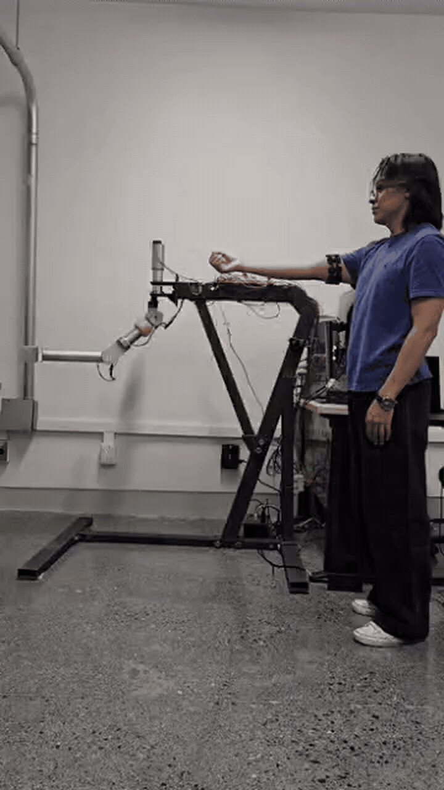
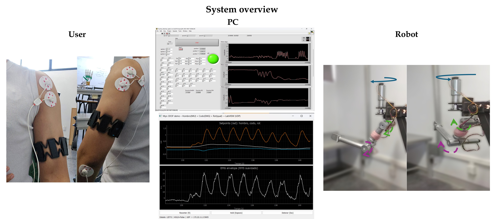
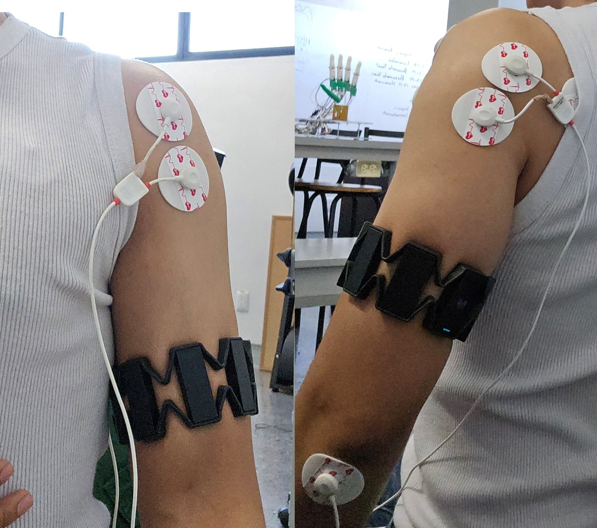
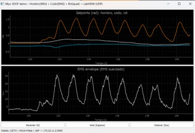
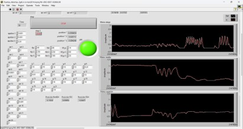
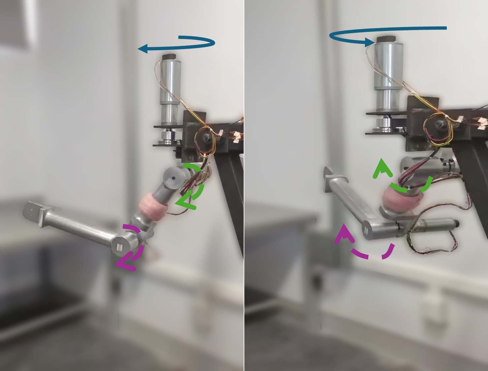
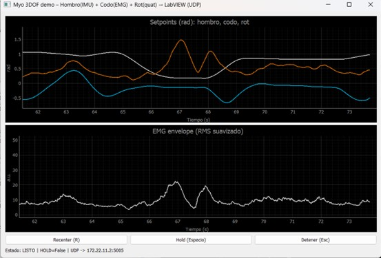

# Myo Open Door 3DOF Demo

<!-- DEMO-GIF -->

<p align="center">
  
</p>

<p align="center">
  <a href="https://github.com/IvanLuna-Ciencias/myo-open-door-3dof/releases/tag/v0.2.0">
    <strong>Watch the complete system demonstration</strong>
  </a>
</p>


Real-time demo using a **Myo Armband** to generate three upper-limb setpoints for a LabVIEW-based exoskeleton interface.

The system estimates shoulder, elbow and rotation setpoints from Myo IMU and EMG signals, then sends them to LabVIEW through UDP.

---

## Overview

The demo estimates:

- **Shoulder flexion/extension** from IMU tilt.
- **Elbow flexion/extension** from Myo EMG amplitude.
- **Shoulder/exoskeleton rotation** from quaternion-based twist estimation.

The output consists of three joint setpoints in radians:

```text
q_shoulder_rad, q_elbow_rad, q_rot_rad
```

---

## System Demonstration

The complete system integrates Myo Armband EMG and IMU acquisition, real-time Python processing, UDP communication, LabVIEW and a three-degree-of-freedom robotic platform.

### Complete System



### Myo Armband Placement

The Myo Armband provides the EMG and inertial measurements used to estimate the user's upper-limb commands.



### Real-Time Python Interface

The Python application performs calibration, signal processing and visualization of the estimated shoulder, elbow and rotation setpoints.



### LabVIEW Interface

LabVIEW receives the three joint setpoints through UDP and transfers them to the robotic control environment.



### Robotic Platform Operation

The processed commands are used as references for real-time operation of the robotic platform.



### Example Session Output

The application can save the processed signals and estimated joint commands for later inspection.



---

## Repository Structure

```text
myo-open-door-3dof/
│
├── scripts/
│   └── myo_3dof_hombro_imu_codo_emg_rot_exoaxis_lv.py
│
├── labview/
│   └── Puertas_Abiertas_3gdL.vi
│
├── data/
│   └── README.md
│
├── docs/
│   └── README.md
│
├── outputs/
│   └── README.md
│
├── requirements.txt
├── .gitignore
└── README.md
```

---

## Documentation

Additional technical documentation is available in:

- [Windows setup](docs/setup_windows.md)
- [Configuration file](docs/configuration.md)
- [External dependencies](docs/external_dependencies.md)
- [Myo acquisition](docs/myo_acquisition.md)
- [UDP LabVIEW protocol](docs/udp_labview_protocol.md)
- [Calibration procedure](docs/calibration.md)
- [LabVIEW VI notes](docs/labview_vi.md)
- [Testing checklist](docs/testing_checklist.md)

## Requirements

- Windows
- Python 3.10
- Myo Armband and original USB dongle
- Myo Connect installed and running
- Myo SDK for Windows 0.9.0
- Python dependencies listed in `requirements.txt`
- LabVIEW VI configured to receive UDP packets

Python dependencies are listed in:

```text
requirements.txt
```

---

## Running the Demo

Activate the Python virtual environment:

```powershell
& "path\to\env310\Scripts\Activate.ps1"
```

Run the script:

```powershell
python scripts\myo_3dof_hombro_imu_codo_emg_rot_exoaxis_lv.py
```

The script will open a real-time visualization window and start the Myo acquisition process.

---

## Calibration

The demo uses a two-stage calibration process:

1. Keep the arm down and relaxed for approximately 2 seconds.
2. Flex the biceps strongly for approximately 2 seconds.
3. After calibration, the system starts sending setpoints to LabVIEW.

---

## Keyboard Controls

| Key | Function |
|---|---|
| `R` | Recalibrate |
| `Space` | Hold setpoints |
| `Esc` | Stop the demo |

---

## LabVIEW UDP Communication

The Python script sends the following UDP payload to LabVIEW:

```text
<q_shoulder_rad>,<q_elbow_rad>,<q_rot_rad>\n
```

Default UDP configuration:

```text
Host: 172.22.11.2
Port: 5005
```

These values can be modified directly in the Python script.

---

## Output Files

The script saves session data as `.csv` and `.json` files.

Generated outputs are ignored by Git to avoid uploading experimental data or temporary acquisition files.

---

## Troubleshooting

If this error appears:

```text
Unable to connect to Myo Connect. Is Myo Connect running?
```

Check that:

- Myo Connect is installed.
- Myo Connect is open.
- The Myo Armband is charged.
- The Myo Armband is paired and connected.
- The Bluetooth adapter is connected.
- The Myo SDK path is correctly configured.

The Myo SDK alone is not sufficient to connect the armband. Myo Connect is a separate external application.

---

## Notes

This repository is an initial open-door demo for testing Myo-based acquisition, signal processing and LabVIEW communication before integrating the full multimodal EEG–sEMG–IMU motor intention detection pipeline.

## License

This project is licensed under the MIT License. See the [LICENSE](LICENSE) file for details.

This license applies to the source code and documentation developed for this repository. External software, SDKs, drivers and hardware-specific tools remain subject to their respective licenses.